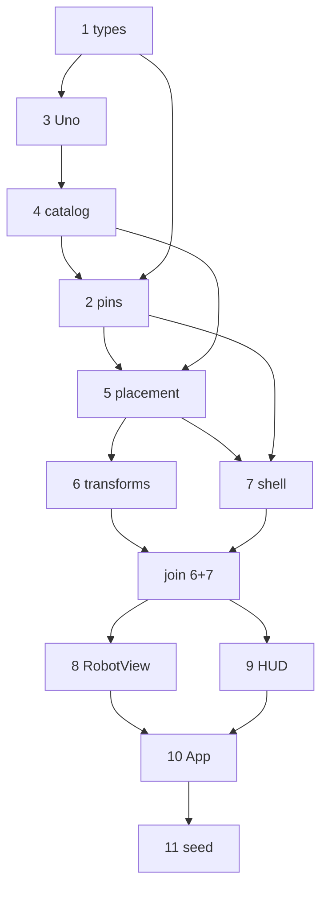

# Build Mode & Remaining Parts Implementation Plan

> **For agentic workers:** REQUIRED SUB-SKILL: Use superpowers:subagent-driven-development (recommended) or superpowers:executing-plans to implement this plan task-by-task. Steps use checkbox (`- [ ]`) syntax for tracking.

**Goal:** Ship a working Build mode where a learner assembles the full PRD §6 robot (7 parts) via select-then-tap placement, gets auto-assigned pins with a guided wiring panel, and can hand off to a Code-mode stub by clicking the Uno — built on the existing part/rendering foundation.

**Architecture:** Pure domain modules own `RobotDesign`, placement validation, and pin assignment. React owns the three-mode shell and Build UI; the 3D scene only renders a design and reports pick events. Code and Race modes are navigation stubs in this plan (editor/emulator/sim land in later plans). Parts remain pure `PartDef` functions; Build never calls `def.build()` except through `buildPart`.

**Tech Stack:** Vite, React 19, TypeScript, three.js, @react-three/fiber, @react-three/drei (Outlines for codeable badge), Vitest. No new runtime deps unless a task explicitly adds one.

## Global Constraints

- **Zero asset bytes.** No `.glb`, `.gltf`, `.hdr`, or image files. A test already enforces banned loaders.
- **No mesh booleans / no `three-bvh-csg`.** Holes via `THREE.Path` in `ExtrudeGeometry` only.
- **Shared materials only.** Parts return `MaterialKey` strings.
- **Low fixed segment counts.** Curve segments 12–16 high / 8 low; never above 16.
- **Units are metres.** A 45mm board is `0.045`.
- **Select-then-tap, not drag-and-drop.** One interaction grammar for mouse, touch, and keyboard (design §10).
- **Grid pitch is real.** Chassis deck uses `0.00254` m (0.1"); placements snap to cells (design §11).
- **Only the Arduino Uno is `codeable: true`** (design §6).
- **Auto-assign pins on place; wiring panel one tap away** (design §8). No 3D wire dragging.
- **Search open source before writing from scratch.** Record verdicts in the design spec §2 table when adopting a library.
- **Licences:** MIT or Apache 2.0 only.
- **This plan does not build** CodeMirror, the emulator, Race sim, replay, Groq, or export. Those are later plans. Code/Race exist only as shell stubs so Build handoffs compile.

## Scope boundary (read this)

| In this plan | Later plans |
|---|---|
| Mode shell: Build / Code / Race tabs | CodeMirror + 4-layer ladder |
| 4 missing parts + full registry | Emulator (JSCPP/avr8js) |
| `RobotDesign` + localStorage | Race track, physics, overlays, replay |
| Select-then-tap + grid + snap place | Playwright Build→Code→Race smoke (needs Code+Race) |
| Pin auto-assign + wiring panel | `.ino` + wiring-diagram export |
| Weight/balance heuristic | Backend save |

**Suggested follow-on plans after this one:** (1) Code mode + emulator, (2) Race mode + replay.

## Execution graph (parallel waves)

Orchestrator runs multi-subagent SDD: parallel implementers only on disjoint files / separate worktrees; orchestrator audits and joins.



| Wave | Tasks | Mode |
|---|---|---|
| A–C | 1 → 3 → 4 → 2 | serial (done / doing) |
| D | 5 | serial |
| E | 6 \|\| 7 | **parallel** (disjoint: `design/transforms|balance` vs `persist|state|shell`) |
| F | merge 6+7 | orchestrator join |
| G | 8 \|\| 9 | **parallel** (disjoint: `scene/*` vs `build/*`) |
| H–I | 10 → 11 | serial |

Live status: `.superpowers/sdd/task-graph.md` (gitignored).

## File Structure

| File | Responsibility |
|---|---|
| `src/design/types.ts` | `RobotDesign`, `PlacedPart`, placement union, pin map types |
| `src/design/createDesign.ts` | Empty design + PRD starter robot factory |
| `src/design/pins.ts` | Board pin pool, auto-assign, reassign, validity |
| `src/design/placement.ts` | Snap + grid occupancy, propose/commit placement |
| `src/design/balance.ts` | Centre-of-mass heuristic from placed masses |
| `src/design/persist.ts` | localStorage load/save |
| `src/parts/uno.ts` | Arduino Uno — only `codeable` part |
| `src/parts/motor.ts` | DC gearmotor (PWM pin consumer) |
| `src/parts/irSensor.ts` | IR line sensor pair |
| `src/parts/battery.ts` | Fixed battery pack |
| `src/parts/registry.ts` | Register all 7 parts (modify) |
| `src/state/DesignContext.tsx` | React context: design, selection, mode, actions |
| `src/shell/AppShell.tsx` | Mode tabs + readiness chips |
| `src/shell/CodeStub.tsx` | Code-mode placeholder showing derived pin constants |
| `src/shell/RaceStub.tsx` | Race-mode placeholder |
| `src/build/PartPalette.tsx` | Part catalog list |
| `src/build/WiringPanel.tsx` | Flat 2D board + part pin reassignment |
| `src/build/BalanceMeter.tsx` | Weight/balance indicator |
| `src/build/BuildHud.tsx` | Composes palette, wiring, balance, nudge controls |
| `src/scene/RobotView.tsx` | Renders all placed parts with transforms |
| `src/scene/MountTargets.tsx` | Large tap targets for recommended snaps + grid cells |
| `src/scene/CodeableMark.tsx` | Outlines + badge on codeable parts |
| `src/App.tsx` | Wire shell + studio + design provider (modify) |
| `tests/design/*.test.ts` | Domain tests |
| `tests/uno.test.ts` … | Part tests (one per new part) |
| `tests/budget.test.ts` | Update reference robot to full PRD §6 set (modify) |

---

### Task 1: `RobotDesign` types and factories

**Files:**
- Create: `src/design/types.ts`, `src/design/createDesign.ts`
- Test: `tests/design/createDesign.test.ts`

**Interfaces:**
- Consumes: nothing from prior Build tasks; uses string part ids from the registry conceptually.
- Produces: types below, plus `createEmptyDesign()`, `createStarterDesign()`, `newInstanceId()`.

- [ ] **Step 1: Write the failing test**

Create `tests/design/createDesign.test.ts`:

```ts
import { describe, expect, it } from 'vitest';
import { createEmptyDesign, createStarterDesign } from '../../src/design/createDesign';

describe('createDesign', () => {
  it('starts empty with a version tag', () => {
    const d = createEmptyDesign();
    expect(d.version).toBe(1);
    expect(d.parts).toEqual([]);
    expect(d.selectedInstanceId).toBeNull();
  });

  it('starter design includes the PRD §6 bill of materials', () => {
    const ids = createStarterDesign().parts.map((p) => p.partId).sort();
    expect(ids).toEqual(
      ['battery-pack', 'chassis-2wd', 'dc-motor', 'dc-motor', 'hc-sr04', 'ir-line-pair', 'uno-r3', 'wheel-65', 'wheel-65'].sort(),
    );
  });

  it('gives every placed part a unique instanceId', () => {
    const parts = createStarterDesign().parts;
    expect(new Set(parts.map((p) => p.instanceId)).size).toBe(parts.length);
  });
});
```

- [ ] **Step 2: Run it to verify it fails**

Run: `npm test -- tests/design/createDesign.test.ts`
Expected: FAIL — cannot resolve `../../src/design/createDesign`.

- [ ] **Step 3: Write `src/design/types.ts`**

```ts
export type BoardPinId =
  | 'D2' | 'D3' | 'D4' | 'D5' | 'D6' | 'D7' | 'D8' | 'D9' | 'D10' | 'D11' | 'D12' | 'D13'
  | 'A0' | 'A1' | 'A2' | 'A3' | 'A4' | 'A5'
  | '5V' | 'GND';

/** Snap attachment: part snap ↔ host snap (e.g. wheel → chassis shaft). */
export interface SnapPlacement {
  kind: 'snap';
  hostInstanceId: string;
  hostSnapId: string;
  partSnapId: string;
}

/** Grid attachment on a MountSurface (deck sensors, Uno, battery, motors). */
export interface GridPlacement {
  kind: 'grid';
  hostInstanceId: string;
  surfaceId: string;
  col: number;
  row: number;
  /** Quarter-turns about the surface normal. */
  rotationSteps: number;
}

export type Placement = SnapPlacement | GridPlacement;

export interface PlacedPart {
  instanceId: string;
  partId: string;
  params: Record<string, number>;
  placement: Placement | null;
  /** Part pin id → board pin id. Empty until assigned. */
  pinMap: Record<string, BoardPinId>;
}

export interface RobotDesign {
  version: 1;
  parts: PlacedPart[];
  selectedInstanceId: string | null;
}

export type AppMode = 'build' | 'code' | 'race';
```

- [ ] **Step 4: Write `src/design/createDesign.ts`**

```ts
import type { PlacedPart, RobotDesign } from './types';

let nextId = 1;
export function newInstanceId(prefix = 'p'): string {
  nextId += 1;
  return `${prefix}_${nextId.toString(36)}`;
}

function placed(partId: string, extras: Partial<PlacedPart> = {}): PlacedPart {
  return {
    instanceId: newInstanceId(partId),
    partId,
    params: {},
    placement: null,
    pinMap: {},
    ...extras,
  };
}

export function createEmptyDesign(): RobotDesign {
  return { version: 1, parts: [], selectedInstanceId: null };
}

/**
 * PRD §6 BOM, unplaced. Placement + pin assignment happen in later tasks
 * via `placePart` / `autoAssignPins` so factories stay free of registry coupling.
 */
export function createStarterDesign(): RobotDesign {
  return {
    version: 1,
    selectedInstanceId: null,
    parts: [
      placed('chassis-2wd'),
      placed('uno-r3'),
      placed('dc-motor'),
      placed('dc-motor'),
      placed('wheel-65'),
      placed('wheel-65'),
      placed('ir-line-pair'),
      placed('hc-sr04'),
      placed('battery-pack'),
    ],
  };
}
```

- [ ] **Step 5: Run test to verify it passes**

Run: `npm test -- tests/design/createDesign.test.ts`
Expected: PASS, 3 tests.

- [ ] **Step 6: Commit**

```bash
git add src/design/types.ts src/design/createDesign.ts tests/design/createDesign.test.ts
git commit -m "feat(design): add RobotDesign types and starter factory"
```

---

### Task 2: Pin auto-assignment

**Files:**
- Create: `src/design/pins.ts`
- Test: `tests/design/pins.test.ts`

**Interfaces:**
- Consumes: `RobotDesign`, `PlacedPart`, `BoardPinId` from Task 1; `getPart` / `PinKind` from `src/parts/*`.
- Produces: `UNO_PINS`, `autoAssignPins(design, instanceId)`, `reassignPin(design, instanceId, partPinId, boardPin)`, `usedBoardPins(design)`.

- [ ] **Step 1: Write the failing test**

Create `tests/design/pins.test.ts`:

```ts
import { describe, expect, it } from 'vitest';
import { createEmptyDesign, newInstanceId } from '../../src/design/createDesign';
import { autoAssignPins, reassignPin, usedBoardPins } from '../../src/design/pins';
import type { PlacedPart, RobotDesign } from '../../src/design/types';

function withParts(parts: PlacedPart[]): RobotDesign {
  return { ...createEmptyDesign(), parts };
}

describe('pin assignment', () => {
  it('assigns PWM-capable pins to motor pwm pins', () => {
    const motorId = newInstanceId('m');
    const unoId = newInstanceId('u');
    let design = withParts([
      { instanceId: unoId, partId: 'uno-r3', params: {}, placement: null, pinMap: {} },
      { instanceId: motorId, partId: 'dc-motor', params: {}, placement: null, pinMap: {} },
    ]);
    design = autoAssignPins(design, motorId);
    const motor = design.parts.find((p) => p.instanceId === motorId)!;
    expect(motor.pinMap.pwm).toMatch(/^D(3|5|6|9|10|11)$/);
    expect(motor.pinMap.vcc).toBe('5V');
    expect(motor.pinMap.gnd).toBe('GND');
  });

  it('does not reuse a board pin across parts', () => {
    const a = newInstanceId('a');
    const b = newInstanceId('b');
    const uno = newInstanceId('u');
    let design = withParts([
      { instanceId: uno, partId: 'uno-r3', params: {}, placement: null, pinMap: {} },
      { instanceId: a, partId: 'dc-motor', params: {}, placement: null, pinMap: {} },
      { instanceId: b, partId: 'dc-motor', params: {}, placement: null, pinMap: {} },
    ]);
    design = autoAssignPins(design, a);
    design = autoAssignPins(design, b);
    const used = usedBoardPins(design).filter((p) => p.startsWith('D'));
    expect(new Set(used).size).toBe(used.length);
  });

  it('reassignPin moves a mapping and frees the old pin', () => {
    const motorId = newInstanceId('m');
    const unoId = newInstanceId('u');
    let design = withParts([
      { instanceId: unoId, partId: 'uno-r3', params: {}, placement: null, pinMap: {} },
      { instanceId: motorId, partId: 'dc-motor', params: {}, placement: null, pinMap: { pwm: 'D3', vcc: '5V', gnd: 'GND' } },
    ]);
    design = reassignPin(design, motorId, 'pwm', 'D5');
    const motor = design.parts.find((p) => p.instanceId === motorId)!;
    expect(motor.pinMap.pwm).toBe('D5');
    expect(usedBoardPins(design)).toContain('D5');
    expect(usedBoardPins(design)).not.toContain('D3');
  });
});
```

- [ ] **Step 2: Run it to verify it fails**

Run: `npm test -- tests/design/pins.test.ts`
Expected: FAIL — cannot resolve pins module (and `dc-motor` / `uno-r3` are not in registry yet — **pin logic must key off pin kinds via a local table for missing parts OR Task 3–4 land first**).

**Order note:** Implement Tasks 3–4 (parts) before finishing this task if `getPart` is used. Prefer a pure kind-matching approach that reads `getPart(partId).pins` so this task depends on Tasks 3–4. **Execute Tasks 3 and 4 before Step 3 of this task.**

- [ ] **Step 3: Write `src/design/pins.ts`**

```ts
import { getPart } from '../parts/registry';
import type { PinKind } from '../parts/types';
import type { BoardPinId, RobotDesign } from './types';

interface BoardPin {
  id: BoardPinId;
  kinds: PinKind[];
}

/** Arduino Uno R3 pool. Power/ground are shareable; signal pins are exclusive. */
export const UNO_PINS: BoardPin[] = [
  { id: 'D2', kinds: ['digital'] },
  { id: 'D3', kinds: ['digital', 'pwm'] },
  { id: 'D4', kinds: ['digital'] },
  { id: 'D5', kinds: ['digital', 'pwm'] },
  { id: 'D6', kinds: ['digital', 'pwm'] },
  { id: 'D7', kinds: ['digital'] },
  { id: 'D8', kinds: ['digital'] },
  { id: 'D9', kinds: ['digital', 'pwm'] },
  { id: 'D10', kinds: ['digital', 'pwm'] },
  { id: 'D11', kinds: ['digital', 'pwm'] },
  { id: 'D12', kinds: ['digital'] },
  { id: 'D13', kinds: ['digital'] },
  { id: 'A0', kinds: ['analog', 'digital'] },
  { id: 'A1', kinds: ['analog', 'digital'] },
  { id: 'A2', kinds: ['analog', 'digital'] },
  { id: 'A3', kinds: ['analog', 'digital'] },
  { id: 'A4', kinds: ['analog', 'digital'] },
  { id: 'A5', kinds: ['analog', 'digital'] },
  { id: '5V', kinds: ['power'] },
  { id: 'GND', kinds: ['ground'] },
];

const SHAREABLE: ReadonlySet<BoardPinId> = new Set(['5V', 'GND']);

export function usedBoardPins(design: RobotDesign): BoardPinId[] {
  const used: BoardPinId[] = [];
  for (const part of design.parts) {
    for (const boardPin of Object.values(part.pinMap)) used.push(boardPin);
  }
  return used;
}

function isFree(design: RobotDesign, boardPin: BoardPinId, exceptInstanceId?: string): boolean {
  if (SHAREABLE.has(boardPin)) return true;
  for (const part of design.parts) {
    if (part.instanceId === exceptInstanceId) continue;
    if (Object.values(part.pinMap).includes(boardPin)) return false;
  }
  return true;
}

function pickPin(design: RobotDesign, kind: PinKind, exceptInstanceId: string): BoardPinId | null {
  const candidate = UNO_PINS.find(
    (p) => p.kinds.includes(kind) && isFree(design, p.id, exceptInstanceId),
  );
  return candidate?.id ?? null;
}

export function autoAssignPins(design: RobotDesign, instanceId: string): RobotDesign {
  const target = design.parts.find((p) => p.instanceId === instanceId);
  if (!target) return design;
  const def = getPart(target.partId);
  if (def.codeable || def.pins.length === 0) return design;

  const pinMap = { ...target.pinMap };
  let working = design;
  for (const pin of def.pins) {
    if (pinMap[pin.id]) continue;
    const chosen = pickPin(working, pin.kind, instanceId);
    if (!chosen) continue;
    pinMap[pin.id] = chosen;
    working = {
      ...working,
      parts: working.parts.map((p) =>
        p.instanceId === instanceId ? { ...p, pinMap: { ...pinMap } } : p,
      ),
    };
  }
  return working;
}

export function reassignPin(
  design: RobotDesign,
  instanceId: string,
  partPinId: string,
  boardPin: BoardPinId,
): RobotDesign {
  if (!isFree(design, boardPin, instanceId)) {
    throw new Error(`Board pin ${boardPin} is already in use`);
  }
  const target = design.parts.find((p) => p.instanceId === instanceId);
  if (!target) return design;
  const def = getPart(target.partId);
  const pinDef = def.pins.find((p) => p.id === partPinId);
  if (!pinDef) throw new Error(`Unknown part pin ${partPinId}`);
  const board = UNO_PINS.find((p) => p.id === boardPin);
  if (!board || !board.kinds.includes(pinDef.kind)) {
    throw new Error(`Board pin ${boardPin} cannot accept kind ${pinDef.kind}`);
  }
  return {
    ...design,
    parts: design.parts.map((p) =>
      p.instanceId === instanceId
        ? { ...p, pinMap: { ...p.pinMap, [partPinId]: boardPin } }
        : p,
    ),
  };
}
```

- [ ] **Step 4: Run test to verify it passes**

Run: `npm test -- tests/design/pins.test.ts`
Expected: PASS, 3 tests (requires Tasks 3–4 registry entries).

- [ ] **Step 5: Commit**

```bash
git add src/design/pins.ts tests/design/pins.test.ts
git commit -m "feat(design): auto-assign and reassign board pins"
```

---

### Task 3: Arduino Uno part

**Files:**
- Create: `src/parts/uno.ts`
- Modify: `src/parts/registry.ts`
- Test: `tests/uno.test.ts`

**Interfaces:**
- Consumes: `PartDef` contract, `buildPart`.
- Produces: `uno: PartDef<UnoParams>` with `id: 'uno-r3'`, `codeable: true`, deck footprint, empty `pins` (board pins live in `UNO_PINS`, not on the PartDef — the Uno is the assigner, not a consumer).

- [ ] **Step 1: Write the failing test**

Create `tests/uno.test.ts`:

```ts
import { describe, expect, it } from 'vitest';
import { buildPart } from '../src/geometry/buildPart';
import { uno } from '../src/parts/uno';

describe('arduino uno', () => {
  it('is the only codeable MVP part', () => {
    expect(uno.codeable).toBe(true);
    expect(uno.id).toBe('uno-r3');
  });

  it('occupies a deck footprint', () => {
    expect(uno.footprint.cols).toBeGreaterThan(0);
    expect(uno.footprint.rows).toBeGreaterThan(0);
  });

  it('does not consume pinMap slots (board is the pin pool)', () => {
    expect(uno.pins).toEqual([]);
  });

  it('stays within its triangle budget', () => {
    expect(buildPart(uno).triangleCount).toBeLessThan(4000);
  });

  it('is cheaper at low detail', () => {
    const high = buildPart(uno, undefined, 'high');
    const low = buildPart(uno, undefined, 'low');
    expect(low.triangleCount).toBeLessThan(high.triangleCount);
  });
});
```

- [ ] **Step 2: Run it to verify it fails**

Run: `npm test -- tests/uno.test.ts`
Expected: FAIL — cannot resolve `../src/parts/uno`.

- [ ] **Step 3: Write `src/parts/uno.ts`**

```ts
import * as THREE from 'three';
import type { PartDef, PartPiece } from './types';

export interface UnoParams {
  boardWidth: number;
  boardHeight: number;
  boardThickness: number;
}

export const uno: PartDef<UnoParams> = {
  id: 'uno-r3',
  label: 'Arduino Uno R3',
  defaultParams: {
    boardWidth: 0.0686,
    boardHeight: 0.0533,
    boardThickness: 0.0016,
  },
  massKg: 0.025,
  codeable: true,
  // ~68.6×53.3mm at 2.54mm pitch
  footprint: { cols: 27, rows: 21 },
  snaps: [{ id: 'mount', type: 'deck-mount', position: [0, 0, 0], normal: [0, 0, 1] }],
  pins: [],
  build(params, ctx): PartPiece[] {
    const halfW = params.boardWidth / 2;
    const halfH = params.boardHeight / 2;
    const shape = new THREE.Shape();
    shape.moveTo(-halfW, -halfH);
    shape.lineTo(halfW, -halfH);
    shape.lineTo(halfW, halfH);
    shape.lineTo(-halfW, halfH);
    shape.closePath();

    const board = new THREE.ExtrudeGeometry(shape, {
      depth: params.boardThickness,
      bevelEnabled: false,
      curveSegments: 1,
    });
    const pieces: PartPiece[] = [{ name: 'board', geometry: board, material: 'pcb' }];

    if (ctx.detail === 'high') {
      const usb = new THREE.BoxGeometry(0.012, 0.016, 0.006);
      usb.translate(-halfW + 0.006, 0, params.boardThickness + 0.003);
      pieces.push({ name: 'usb', geometry: usb, material: 'metal' });

      const mcu = new THREE.BoxGeometry(0.01, 0.01, 0.002);
      mcu.translate(0.005, 0, params.boardThickness + 0.001);
      pieces.push({ name: 'mcu', geometry: mcu, material: 'dark' });

      const header = new THREE.BoxGeometry(0.0025, 0.04, 0.008);
      header.translate(halfW - 0.004, 0, params.boardThickness + 0.004);
      pieces.push({ name: 'header', geometry: header, material: 'dark' });
    }

    return pieces;
  },
};
```

- [ ] **Step 4: Register it**

Modify `src/parts/registry.ts` to import and register `uno` under `uno.id`.

- [ ] **Step 5: Run tests**

Run: `npm test -- tests/uno.test.ts tests/registry.test.ts`
Expected: PASS. Update `tests/registry.test.ts` if it asserts exact key count — expect 4 keys after this task, 7 after Task 4.

- [ ] **Step 6: Commit**

```bash
git add src/parts/uno.ts src/parts/registry.ts tests/uno.test.ts tests/registry.test.ts
git commit -m "feat(parts): add codeable Arduino Uno R3"
```

---

### Task 4: Motor, IR sensor, battery + full registry + budget

**Files:**
- Create: `src/parts/motor.ts`, `src/parts/irSensor.ts`, `src/parts/battery.ts`
- Modify: `src/parts/registry.ts`, `tests/budget.test.ts`, `tests/registry.test.ts`
- Test: `tests/motor.test.ts`, `tests/irSensor.test.ts`, `tests/battery.test.ts`

**Interfaces:**
- Produces: `motor` id `dc-motor` (pins: pwm/vcc/gnd), `irSensor` id `ir-line-pair` (pins: left/right analog + vcc/gnd), `battery` id `battery-pack` (no pins).

**Accepted simplification:** wheels keep snapping to chassis `wheel-shaft` mounts (foundation already tested). Motors are deck-grid parts that consume PWM pins for wiring/code — they do not sit in the mechanical shaft chain yet. Document in the motor file header comment.

- [ ] **Step 1: Write failing motor / IR / battery tests**

Create `tests/motor.test.ts`:

```ts
import { describe, expect, it } from 'vitest';
import { buildPart } from '../src/geometry/buildPart';
import { motor } from '../src/parts/motor';

describe('dc motor', () => {
  it('needs a PWM pin plus power rails', () => {
    expect(motor.pins.map((p) => p.id).sort()).toEqual(['gnd', 'pwm', 'vcc']);
    expect(motor.pins.find((p) => p.id === 'pwm')?.kind).toBe('pwm');
  });

  it('has a deck footprint', () => {
    expect(motor.footprint.cols).toBeGreaterThan(0);
  });

  it('stays within its triangle budget', () => {
    expect(buildPart(motor).triangleCount).toBeLessThan(2000);
  });
});
```

Create `tests/irSensor.test.ts`:

```ts
import { describe, expect, it } from 'vitest';
import { buildPart } from '../src/geometry/buildPart';
import { irSensor } from '../src/parts/irSensor';

describe('ir line sensor pair', () => {
  it('exposes left/right analog channels', () => {
    expect(irSensor.pins.filter((p) => p.kind === 'analog').map((p) => p.id).sort()).toEqual([
      'left',
      'right',
    ]);
  });

  it('stays within its triangle budget', () => {
    expect(buildPart(irSensor).triangleCount).toBeLessThan(2500);
  });
});
```

Create `tests/battery.test.ts`:

```ts
import { describe, expect, it } from 'vitest';
import { buildPart } from '../src/geometry/buildPart';
import { battery } from '../src/parts/battery';

describe('battery pack', () => {
  it('has no signal pins', () => {
    expect(battery.pins).toEqual([]);
  });

  it('stays within its triangle budget', () => {
    expect(buildPart(battery).triangleCount).toBeLessThan(1500);
  });
});
```

- [ ] **Step 2: Run to verify fail**

Run: `npm test -- tests/motor.test.ts tests/irSensor.test.ts tests/battery.test.ts`
Expected: FAIL — modules missing.

- [ ] **Step 3: Write the three part files**

`src/parts/motor.ts`:

```ts
import * as THREE from 'three';
import type { PartDef, PartPiece } from './types';

export interface MotorParams {
  bodyRadius: number;
  bodyLength: number;
  shaftRadius: number;
  shaftLength: number;
}

/**
 * Deck-mounted gearmotor. Mechanical shaft→wheel coupling stays on the chassis
 * wheel-shaft snaps for MVP; this part exists so Build can assign PWM pins.
 */
export const motor: PartDef<MotorParams> = {
  id: 'dc-motor',
  label: 'DC Gearmotor',
  defaultParams: {
    bodyRadius: 0.012,
    bodyLength: 0.025,
    shaftRadius: 0.0015,
    shaftLength: 0.01,
  },
  massKg: 0.04,
  codeable: false,
  footprint: { cols: 10, rows: 8 },
  snaps: [{ id: 'mount', type: 'deck-mount', position: [0, 0, 0], normal: [0, 0, 1] }],
  pins: [
    { id: 'pwm', kind: 'pwm' },
    { id: 'vcc', kind: 'power' },
    { id: 'gnd', kind: 'ground' },
  ],
  build(params, ctx): PartPiece[] {
    const body = new THREE.CylinderGeometry(
      params.bodyRadius,
      params.bodyRadius,
      params.bodyLength,
      ctx.segments,
    );
    body.rotateZ(Math.PI / 2);
    body.translate(0, 0, params.bodyRadius);
    const pieces: PartPiece[] = [{ name: 'body', geometry: body, material: 'metal' }];

    if (ctx.detail === 'high') {
      const shaft = new THREE.CylinderGeometry(
        params.shaftRadius,
        params.shaftRadius,
        params.shaftLength,
        8,
      );
      shaft.rotateZ(Math.PI / 2);
      shaft.translate(params.bodyLength / 2 + params.shaftLength / 2, 0, params.bodyRadius);
      pieces.push({ name: 'shaft', geometry: shaft, material: 'gold' });
    }
    return pieces;
  },
};
```

`src/parts/irSensor.ts`:

```ts
import * as THREE from 'three';
import type { PartDef, PartPiece } from './types';

export interface IrSensorParams {
  boardWidth: number;
  boardHeight: number;
  boardThickness: number;
}

export const irSensor: PartDef<IrSensorParams> = {
  id: 'ir-line-pair',
  label: 'IR Line Sensor Pair',
  defaultParams: {
    boardWidth: 0.04,
    boardHeight: 0.012,
    boardThickness: 0.0015,
  },
  massKg: 0.006,
  codeable: false,
  footprint: { cols: 16, rows: 5 },
  snaps: [{ id: 'mount', type: 'deck-mount', position: [0, 0, 0], normal: [0, 0, 1] }],
  pins: [
    { id: 'left', kind: 'analog' },
    { id: 'right', kind: 'analog' },
    { id: 'vcc', kind: 'power' },
    { id: 'gnd', kind: 'ground' },
  ],
  build(params, ctx): PartPiece[] {
    const halfW = params.boardWidth / 2;
    const halfH = params.boardHeight / 2;
    const shape = new THREE.Shape();
    shape.moveTo(-halfW, -halfH);
    shape.lineTo(halfW, -halfH);
    shape.lineTo(halfW, halfH);
    shape.lineTo(-halfW, halfH);
    shape.closePath();
    const board = new THREE.ExtrudeGeometry(shape, {
      depth: params.boardThickness,
      bevelEnabled: false,
    });
    const pieces: PartPiece[] = [{ name: 'board', geometry: board, material: 'pcb' }];
    for (const [i, x] of [-0.01, 0.01].entries()) {
      const eye = new THREE.BoxGeometry(0.005, 0.005, 0.004);
      eye.translate(x, 0, params.boardThickness + 0.002);
      pieces.push({ name: `eye-${i}`, geometry: eye, material: 'dark' });
      if (ctx.detail === 'high') {
        const led = new THREE.BoxGeometry(0.003, 0.003, 0.002);
        led.translate(x, 0.004, params.boardThickness + 0.001);
        pieces.push({ name: `led-${i}`, geometry: led, material: 'accent' });
      }
    }
    return pieces;
  },
};
```

`src/parts/battery.ts`:

```ts
import * as THREE from 'three';
import type { PartDef, PartPiece } from './types';

export interface BatteryParams {
  width: number;
  height: number;
  depth: number;
}

export const battery: PartDef<BatteryParams> = {
  id: 'battery-pack',
  label: 'AA Battery Pack',
  defaultParams: { width: 0.058, height: 0.032, depth: 0.015 },
  massKg: 0.1,
  codeable: false,
  footprint: { cols: 23, rows: 13 },
  snaps: [{ id: 'mount', type: 'deck-mount', position: [0, 0, 0], normal: [0, 0, 1] }],
  pins: [],
  build(params): PartPiece[] {
    const box = new THREE.BoxGeometry(params.width, params.height, params.depth);
    box.translate(0, 0, params.depth / 2);
    return [{ name: 'pack', geometry: box, material: 'dark' }];
  },
};
```

- [ ] **Step 4: Update registry to all 7 parts**

```ts
import type { PartDef } from './types';
import { battery } from './battery';
import { chassis } from './chassis';
import { irSensor } from './irSensor';
import { motor } from './motor';
import { ultrasonic } from './ultrasonic';
import { uno } from './uno';
import { wheel } from './wheel';

export const PART_REGISTRY = {
  [chassis.id]: chassis,
  [wheel.id]: wheel,
  [ultrasonic.id]: ultrasonic,
  [uno.id]: uno,
  [motor.id]: motor,
  [irSensor.id]: irSensor,
  [battery.id]: battery,
} as unknown as Record<string, PartDef<never>>;

export function getPart(id: string): PartDef<never> {
  const def = PART_REGISTRY[id];
  if (!def) throw new Error(`Unknown part id: ${id}`);
  return def;
}
```

Update `tests/registry.test.ts` to expect keys:
`['battery-pack','chassis-2wd','dc-motor','hc-sr04','ir-line-pair','uno-r3','wheel-65']`.

- [ ] **Step 5: Update performance budget reference robot**

Replace `referenceRobot` in `tests/budget.test.ts` with the full PRD §6 set:

```ts
import { battery } from '../src/parts/battery';
import { chassis } from '../src/parts/chassis';
import { irSensor } from '../src/parts/irSensor';
import { motor } from '../src/parts/motor';
import { ultrasonic } from '../src/parts/ultrasonic';
import { uno } from '../src/parts/uno';
import { wheel } from '../src/parts/wheel';

function referenceRobot() {
  const parts = [
    buildPart(chassis),
    buildPart(uno),
    buildPart(motor),
    buildPart(motor),
    buildPart(wheel),
    buildPart(wheel),
    buildPart(irSensor),
    buildPart(ultrasonic),
    buildPart(battery),
  ];
  return {
    triangleCount: parts.reduce((sum, p) => sum + p.triangleCount, 0),
    drawCalls: parts.reduce((sum, p) => sum + p.drawCalls, 0),
  };
}
```

Keep caps at `< 15_000` tris and `< 40` draw calls. If a new part blows the budget, lower its high-detail cosmetics — do not raise the cap without an explicit design change.

- [ ] **Step 6: Run full suite**

Run: `npm test`
Expected: PASS. Then finish Task 2 Step 3–5 if deferred.

- [ ] **Step 7: Commit**

```bash
git add src/parts/motor.ts src/parts/irSensor.ts src/parts/battery.ts src/parts/registry.ts \
  tests/motor.test.ts tests/irSensor.test.ts tests/battery.test.ts tests/registry.test.ts tests/budget.test.ts
git commit -m "feat(parts): complete PRD §6 catalog (motor, IR, battery)"
```

---

### Task 5: Placement engine (snap + grid)

**Files:**
- Create: `src/design/placement.ts`
- Test: `tests/design/placement.test.ts`

**Interfaces:**
- Consumes: `RobotDesign`, `getPart`, chassis `surfaces`.
- Produces: `listSnapTargets`, `listGridCells`, `canPlaceSnap`, `canPlaceGrid`, `placeOnSnap`, `placeOnGrid`, `nudgeGrid`, `occupiedCells`.

- [ ] **Step 1: Write the failing test**

Create `tests/design/placement.test.ts`:

```ts
import { describe, expect, it } from 'vitest';
import { createEmptyDesign, newInstanceId } from '../../src/design/createDesign';
import { canPlaceGrid, placeOnGrid, placeOnSnap, occupiedCells } from '../../src/design/placement';
import type { PlacedPart, RobotDesign } from '../../src/design/types';

function designOf(parts: PlacedPart[]): RobotDesign {
  return { ...createEmptyDesign(), parts };
}

describe('placement', () => {
  it('snaps a wheel onto a free chassis shaft', () => {
    const chassisId = newInstanceId('c');
    const wheelId = newInstanceId('w');
    let d = designOf([
      { instanceId: chassisId, partId: 'chassis-2wd', params: {}, placement: null, pinMap: {} },
      { instanceId: wheelId, partId: 'wheel-65', params: {}, placement: null, pinMap: {} },
    ]);
    d = placeOnSnap(d, wheelId, chassisId, 'wheel-fl', 'shaft');
    const wheel = d.parts.find((p) => p.instanceId === wheelId)!;
    expect(wheel.placement).toEqual({
      kind: 'snap',
      hostInstanceId: chassisId,
      hostSnapId: 'wheel-fl',
      partSnapId: 'shaft',
    });
  });

  it('rejects overlapping grid footprints', () => {
    const chassisId = newInstanceId('c');
    const a = newInstanceId('a');
    const b = newInstanceId('b');
    let d = designOf([
      { instanceId: chassisId, partId: 'chassis-2wd', params: {}, placement: null, pinMap: {} },
      { instanceId: a, partId: 'hc-sr04', params: {}, placement: null, pinMap: {} },
      { instanceId: b, partId: 'hc-sr04', params: {}, placement: null, pinMap: {} },
    ]);
    d = placeOnGrid(d, a, chassisId, 'deck', 0, 0, 0);
    expect(canPlaceGrid(d, b, chassisId, 'deck', 0, 0, 0)).toBe(false);
    expect(canPlaceGrid(d, b, chassisId, 'deck', 20, 0, 0)).toBe(true);
  });

  it('tracks occupied cells for a placed sensor', () => {
    const chassisId = newInstanceId('c');
    const sensorId = newInstanceId('s');
    let d = designOf([
      { instanceId: chassisId, partId: 'chassis-2wd', params: {}, placement: null, pinMap: {} },
      { instanceId: sensorId, partId: 'hc-sr04', params: {}, placement: null, pinMap: {} },
    ]);
    d = placeOnGrid(d, sensorId, chassisId, 'deck', 2, 3, 0);
    const cells = occupiedCells(d, chassisId, 'deck');
    expect(cells.has('2,3')).toBe(true);
  });
});
```

- [ ] **Step 2: Run to verify fail**

Run: `npm test -- tests/design/placement.test.ts`
Expected: FAIL — module missing.

- [ ] **Step 3: Write `src/design/placement.ts`**

```ts
import { getPart } from '../parts/registry';
import type { MountSurface, SnapPoint } from '../parts/types';
import type { GridPlacement, RobotDesign, SnapPlacement } from './types';

function hostSurface(hostPartId: string, surfaceId: string, params: Record<string, number>): MountSurface {
  const def = getPart(hostPartId);
  const surfaces = def.surfaces;
  if (!surfaces?.length) throw new Error(`Part ${hostPartId} has no mount surfaces`);
  // Chassis rebuilds the grid from params in its def; for MVP read the static default surface
  // and recompute cols/rows if pitch/length present — keep simple: use def.surfaces[0] match by id.
  const surface = surfaces.find((s) => s.id === surfaceId);
  if (!surface) throw new Error(`Unknown surface ${surfaceId}`);
  void params;
  return surface;
}

export function occupiedCells(
  design: RobotDesign,
  hostInstanceId: string,
  surfaceId: string,
): Set<string> {
  const cells = new Set<string>();
  for (const part of design.parts) {
    const p = part.placement;
    if (!p || p.kind !== 'grid') continue;
    if (p.hostInstanceId !== hostInstanceId || p.surfaceId !== surfaceId) continue;
    const fp = getPart(part.partId).footprint;
    for (let c = 0; c < fp.cols; c += 1) {
      for (let r = 0; r < fp.rows; r += 1) {
        cells.add(`${p.col + c},${p.row + r}`);
      }
    }
  }
  return cells;
}

export function canPlaceGrid(
  design: RobotDesign,
  instanceId: string,
  hostInstanceId: string,
  surfaceId: string,
  col: number,
  row: number,
  _rotationSteps: number,
): boolean {
  const part = design.parts.find((p) => p.instanceId === instanceId);
  const host = design.parts.find((p) => p.instanceId === hostInstanceId);
  if (!part || !host) return false;
  const fp = getPart(part.partId).footprint;
  if (fp.cols <= 0 || fp.rows <= 0) return false;
  const surface = hostSurface(host.partId, surfaceId, host.params);
  if (col < 0 || row < 0 || col + fp.cols > surface.cols || row + fp.rows > surface.rows) {
    return false;
  }
  // Ignore the instance's own cells when nudging.
  const ghost: RobotDesign = {
    ...design,
    parts: design.parts.map((p) =>
      p.instanceId === instanceId ? { ...p, placement: null } : p,
    ),
  };
  const used = occupiedCells(ghost, hostInstanceId, surfaceId);
  for (let c = 0; c < fp.cols; c += 1) {
    for (let r = 0; r < fp.rows; r += 1) {
      if (used.has(`${col + c},${row + r}`)) return false;
    }
  }
  return true;
}

export function placeOnGrid(
  design: RobotDesign,
  instanceId: string,
  hostInstanceId: string,
  surfaceId: string,
  col: number,
  row: number,
  rotationSteps: number,
): RobotDesign {
  if (!canPlaceGrid(design, instanceId, hostInstanceId, surfaceId, col, row, rotationSteps)) {
    throw new Error('Invalid grid placement');
  }
  const placement: GridPlacement = {
    kind: 'grid',
    hostInstanceId,
    surfaceId,
    col,
    row,
    rotationSteps,
  };
  return {
    ...design,
    parts: design.parts.map((p) => (p.instanceId === instanceId ? { ...p, placement } : p)),
    selectedInstanceId: instanceId,
  };
}

function snapById(partId: string, snapId: string): SnapPoint {
  const snap = getPart(partId).snaps.find((s) => s.id === snapId);
  if (!snap) throw new Error(`Unknown snap ${snapId} on ${partId}`);
  return snap;
}

export function canPlaceSnap(
  design: RobotDesign,
  instanceId: string,
  hostInstanceId: string,
  hostSnapId: string,
  partSnapId: string,
): boolean {
  const part = design.parts.find((p) => p.instanceId === instanceId);
  const host = design.parts.find((p) => p.instanceId === hostInstanceId);
  if (!part || !host) return false;
  const a = snapById(part.partId, partSnapId);
  const b = snapById(host.partId, hostSnapId);
  if (a.type !== b.type) return false;
  const taken = design.parts.some(
    (p) =>
      p.instanceId !== instanceId &&
      p.placement?.kind === 'snap' &&
      p.placement.hostInstanceId === hostInstanceId &&
      p.placement.hostSnapId === hostSnapId,
  );
  return !taken;
}

export function placeOnSnap(
  design: RobotDesign,
  instanceId: string,
  hostInstanceId: string,
  hostSnapId: string,
  partSnapId: string,
): RobotDesign {
  if (!canPlaceSnap(design, instanceId, hostInstanceId, hostSnapId, partSnapId)) {
    throw new Error('Invalid snap placement');
  }
  const placement: SnapPlacement = {
    kind: 'snap',
    hostInstanceId,
    hostSnapId,
    partSnapId,
  };
  return {
    ...design,
    parts: design.parts.map((p) => (p.instanceId === instanceId ? { ...p, placement } : p)),
    selectedInstanceId: instanceId,
  };
}

export function nudgeGrid(
  design: RobotDesign,
  instanceId: string,
  dCol: number,
  dRow: number,
): RobotDesign {
  const part = design.parts.find((p) => p.instanceId === instanceId);
  if (!part || part.placement?.kind !== 'grid') return design;
  const { hostInstanceId, surfaceId, col, row, rotationSteps } = part.placement;
  return placeOnGrid(design, instanceId, hostInstanceId, surfaceId, col + dCol, row + dRow, rotationSteps);
}

export function listSnapTargets(
  design: RobotDesign,
  instanceId: string,
): Array<{ hostInstanceId: string; hostSnapId: string; partSnapId: string }> {
  const part = design.parts.find((p) => p.instanceId === instanceId);
  if (!part) return [];
  const partSnaps = getPart(part.partId).snaps;
  const out: Array<{ hostInstanceId: string; hostSnapId: string; partSnapId: string }> = [];
  for (const host of design.parts) {
    if (host.instanceId === instanceId) continue;
    for (const hostSnap of getPart(host.partId).snaps) {
      for (const partSnap of partSnaps) {
        if (
          canPlaceSnap(design, instanceId, host.instanceId, hostSnap.id, partSnap.id)
        ) {
          out.push({
            hostInstanceId: host.instanceId,
            hostSnapId: hostSnap.id,
            partSnapId: partSnap.id,
          });
        }
      }
    }
  }
  return out;
}
```

- [ ] **Step 4: Run tests**

Run: `npm test -- tests/design/placement.test.ts`
Expected: PASS, 3 tests.

- [ ] **Step 5: Commit**

```bash
git add src/design/placement.ts tests/design/placement.test.ts
git commit -m "feat(design): snap and grid placement with occupancy"
```

---

### Task 6: World transforms + balance heuristic

**Files:**
- Create: `src/design/transforms.ts`, `src/design/balance.ts`
- Test: `tests/design/transforms.test.ts`, `tests/design/balance.test.ts`

**Interfaces:**
- Produces: `worldMatrix(design, instanceId): THREE.Matrix4`, `centreOfMass(design): { x, y, z, totalMassKg }`, `balanceScore(design): number` (0 = perfect, 1 = badly off).

- [ ] **Step 1: Write failing tests**

```ts
// tests/design/transforms.test.ts
import * as THREE from 'three';
import { describe, expect, it } from 'vitest';
import { createEmptyDesign, newInstanceId } from '../../src/design/createDesign';
import { placeOnSnap } from '../../src/design/placement';
import { worldPosition } from '../../src/design/transforms';

describe('transforms', () => {
  it('puts a snapped wheel at the chassis snap position', () => {
    const c = newInstanceId('c');
    const w = newInstanceId('w');
    let d = {
      ...createEmptyDesign(),
      parts: [
        { instanceId: c, partId: 'chassis-2wd', params: {}, placement: null, pinMap: {} },
        { instanceId: w, partId: 'wheel-65', params: {}, placement: null, pinMap: {} },
      ],
    };
    d = placeOnSnap(d, w, c, 'wheel-fl', 'shaft');
    const pos = worldPosition(d, w);
    expect(pos.distanceTo(new THREE.Vector3(-0.07, 0.05, 0))).toBeLessThan(1e-6);
  });
});
```

```ts
// tests/design/balance.test.ts
import { describe, expect, it } from 'vitest';
import { createEmptyDesign, newInstanceId } from '../../src/design/createDesign';
import { balanceScore, centreOfMass } from '../../src/design/balance';
import { placeOnGrid } from '../../src/design/placement';

describe('balance', () => {
  it('reports total mass of placed parts only', () => {
    const c = newInstanceId('c');
    const d = {
      ...createEmptyDesign(),
      parts: [
        {
          instanceId: c,
          partId: 'chassis-2wd',
          params: {},
          placement: { kind: 'snap', hostInstanceId: c, hostSnapId: 'x', partSnapId: 'x' } as never,
          pinMap: {},
        },
      ],
    };
    // Chassis with null placement should be treated as origin root:
    d.parts[0].placement = null;
    const com = centreOfMass({
      ...d,
      parts: [{ ...d.parts[0], placement: null }],
    });
    // Root chassis at origin still counts.
    expect(com.totalMassKg).toBeGreaterThan(0.08);
  });

  it('worsens when a heavy pack sits far off-centre', () => {
    const c = newInstanceId('c');
    const bat = newInstanceId('b');
    let centered = {
      ...createEmptyDesign(),
      parts: [
        { instanceId: c, partId: 'chassis-2wd', params: {}, placement: null, pinMap: {} },
        { instanceId: bat, partId: 'battery-pack', params: {}, placement: null, pinMap: {} },
      ],
    };
    centered = placeOnGrid(centered, bat, c, 'deck', 10, 5, 0);
    const mid = balanceScore(centered);
    let offset = {
      ...createEmptyDesign(),
      parts: [
        { instanceId: c, partId: 'chassis-2wd', params: {}, placement: null, pinMap: {} },
        { instanceId: bat, partId: 'battery-pack', params: {}, placement: null, pinMap: {} },
      ],
    };
    offset = placeOnGrid(offset, bat, c, 'deck', 0, 0, 0);
    expect(balanceScore(offset)).toBeGreaterThan(mid);
  });
});
```

Refine the balance test during implementation so both grid placements are valid for the battery footprint; assert relative ordering, not absolute numbers.

- [ ] **Step 2: Implement `src/design/transforms.ts`**

Resolve parent chain: root = part with `placement: null` that others attach to (chassis). For `snap`, world position = host world position + host snap local position (MVP: ignore rotation of part snap alignment beyond copying host snap translation; orient wheel so its snap normal matches — minimum viable: set position only, identity rotation for grid parts with `rotationSteps * π/2` about Z).

Export:

```ts
export function worldPosition(design: RobotDesign, instanceId: string): THREE.Vector3
export function worldQuaternion(design: RobotDesign, instanceId: string): THREE.Quaternion
```

Grid cell → local offset:

```ts
const surface = /* host surface */;
const x = surface.origin[0] + col * surface.pitch;
const y = surface.origin[1] + row * surface.pitch;
const z = surface.origin[2];
```

- [ ] **Step 3: Implement `src/design/balance.ts`**

```ts
export function centreOfMass(design: RobotDesign): {
  x: number; y: number; z: number; totalMassKg: number;
} {
  let mx = 0, my = 0, mz = 0, m = 0;
  for (const part of design.parts) {
    const mass = getPart(part.partId).massKg;
    const p = worldPosition(design, part.instanceId);
    mx += mass * p.x; my += mass * p.y; mz += mass * p.z; m += mass;
  }
  if (m === 0) return { x: 0, y: 0, z: 0, totalMassKg: 0 };
  return { x: mx / m, y: my / m, z: mz / m, totalMassKg: m };
}

/** 0 = centred, approaches 1 as COM drifts toward chassis half-extent. */
export function balanceScore(design: RobotDesign): number {
  const com = centreOfMass(design);
  const extent = 0.08; // ~half chassis length
  return Math.min(1, Math.hypot(com.x, com.y) / extent);
}
```

- [ ] **Step 4: Run tests, fix until PASS, commit**

```bash
git add src/design/transforms.ts src/design/balance.ts tests/design/transforms.test.ts tests/design/balance.test.ts
git commit -m "feat(design): world transforms and balance heuristic"
```

---

### Task 7: Design context + mode shell stubs

**Files:**
- Create: `src/state/DesignContext.tsx`, `src/shell/AppShell.tsx`, `src/shell/CodeStub.tsx`, `src/shell/RaceStub.tsx`, `src/design/persist.ts`
- Test: `tests/design/persist.test.ts`

**Interfaces:**
- Produces: `DesignProvider`, `useDesign()`, actions: `setMode`, `selectPart`, `addPart`, `place…`, `autoAssign`, `reassignPin`, `nudge`, `save`, `load`. Persist key: `roboarena.design.v1`.

- [ ] **Step 1: Persist tests + implementation**

```ts
// tests/design/persist.test.ts
import { describe, expect, it, beforeEach } from 'vitest';
import { createStarterDesign } from '../../src/design/createDesign';
import { loadDesign, saveDesign, STORAGE_KEY } from '../../src/design/persist';

beforeEach(() => {
  localStorage.clear();
});

describe('persist', () => {
  it('round-trips a design through localStorage', () => {
    const original = createStarterDesign();
    saveDesign(original);
    expect(localStorage.getItem(STORAGE_KEY)).toBeTruthy();
    expect(loadDesign()?.parts).toHaveLength(original.parts.length);
  });

  it('returns null when empty', () => {
    expect(loadDesign()).toBeNull();
  });
});
```

`src/design/persist.ts` uses `globalThis.localStorage`; in Vitest enable `environment: 'jsdom'` for this file only via docblock:

```ts
/**
 * @vitest-environment jsdom
 */
```

- [ ] **Step 2: `DesignContext.tsx`**

Provide:

```ts
interface DesignApi {
  design: RobotDesign;
  mode: AppMode;
  setMode: (m: AppMode) => void;
  select: (instanceId: string | null) => void;
  addFromPalette: (partId: string) => void; // appends unplaced + selects
  placeSnap: (...args) => void;
  placeGrid: (...args) => void;
  nudge: (dCol: number, dRow: number) => void;
  rotateSelected: (deltaSteps: number) => void;
  reassignPin: (partPinId: string, boardPin: BoardPinId) => void;
  enterCodeFromBoard: (instanceId: string) => void; // select + setMode('code')
}
```

On `placeSnap` / `placeGrid` success, call `autoAssignPins` for that instance.

- [ ] **Step 3: Shell UI**

`AppShell` renders three buttons: Build / Code / Race. Active mode styles via `aria-current`. Children slot for mode body.

`CodeStub`: list pin constants derived from `design.parts` (`const TRIG = 7` style from `D7`). Message: "Editor and emulator arrive in the Code-mode plan."

`RaceStub`: "Race simulation arrives in the Race-mode plan." + whether design has a chassis + wheels (readiness chip only).

- [ ] **Step 4: Commit**

```bash
git add src/state/DesignContext.tsx src/shell src/design/persist.ts tests/design/persist.test.ts
git commit -m "feat(shell): design context, persistence, mode stubs"
```

---

### Task 8: `RobotView` + codeable mark + mount targets

**Files:**
- Create: `src/scene/RobotView.tsx`, `src/scene/CodeableMark.tsx`, `src/scene/MountTargets.tsx`
- Modify: `src/scene/PartView.tsx` (optional: accept `groupRef` / `onClick`)
- Test: `tests/RobotView.test.tsx` (R3F test renderer — assert group count)

**Interfaces:**
- `RobotView` reads `useDesign()`, maps each placed part through `worldPosition` / `worldQuaternion` into a `<group>`.
- Unplaced parts are hidden from the scene (they exist only in the palette/tray list).
- When `selectedInstanceId` is a part awaiting placement, `MountTargets` draws:
  - snap targets: 0.02 m spheres at each `listSnapTargets` host snap world position
  - grid: faint cell markers for the chassis deck (every Nth cell + all valid cells for footprint under cursor optional; MVP: show recommended snap spheres + a translucent deck plane that accepts pointer taps → nearest valid cell)

- [ ] **Step 1: Extend PartView for click + outlines**

```tsx
// CodeableMark.tsx
import { Outlines } from '@react-three/drei';

export function CodeableMark({ active }: { active: boolean }) {
  if (!active) return null;
  return <Outlines thickness={2} color="#e0603a" />;
}
```

Wrap the first mesh of a codeable part (or the whole group via drei Outlines on a parent mesh). Clicking a codeable instance calls `enterCodeFromBoard(instanceId)`.

- [ ] **Step 2: RobotView**

```tsx
export function RobotView() {
  const { design, select, enterCodeFromBoard } = useDesign();
  return (
    <group>
      {design.parts.filter((p) => p.placement !== null || p.partId === 'chassis-2wd').map((p) => {
        // Chassis may be root with null placement at origin.
        const pos = worldPosition(design, p.instanceId);
        const quat = worldQuaternion(design, p.instanceId);
        const def = getPart(p.partId);
        return (
          <group
            key={p.instanceId}
            position={pos}
            quaternion={quat}
            onClick={(e) => {
              e.stopPropagation();
              if (def.codeable) enterCodeFromBoard(p.instanceId);
              else select(p.instanceId);
            }}
          >
            <PartView partId={p.partId} params={p.params} />
            {def.codeable && <CodeableMark active />}
          </group>
        );
      })}
      <MountTargets />
    </group>
  );
}
```

**Root chassis rule:** ensure starter / empty-build flow always has exactly one chassis at origin with `placement: null`. `addFromPalette('chassis-2wd')` on empty design sets that. Reject a second chassis in `addFromPalette`.

- [ ] **Step 3: MountTargets interaction**

On pointer down on a snap sphere → `placeSnap(...)`.
On pointer down on deck plane → compute nearest grid cell from hit UV/point → `placeGrid(...)` if `canPlaceGrid`.

- [ ] **Step 4: Manual check**

Run: `npm run dev`
Expected: with a temporary hard-coded design in the provider, chassis + ultrasonic appear; selecting ultrasonic from a debug button shows snap/grid targets.

- [ ] **Step 5: Commit**

```bash
git add src/scene/RobotView.tsx src/scene/CodeableMark.tsx src/scene/MountTargets.tsx src/scene/PartView.tsx tests/RobotView.test.tsx
git commit -m "feat(scene): render RobotDesign with mount targets"
```

---

### Task 9: Build HUD — palette, wiring, balance, nudge

**Files:**
- Create: `src/build/PartPalette.tsx`, `src/build/WiringPanel.tsx`, `src/build/BalanceMeter.tsx`, `src/build/BuildHud.tsx`
- Create: `src/build/build.css` (minimal layout; no card-heavy chrome)
- Test: `tests/build/WiringPanel.test.tsx` (jsdom — click pin button calls reassign)

**Interfaces:**
- Palette lists `Object.values(PART_REGISTRY)` labels; click → `addFromPalette`.
- Wiring panel visible when selected part has pins; shows part pins + valid board pins lit; tap part pin then board pin → `reassignPin`.
- BalanceMeter reads `balanceScore` + `totalMassKg`.
- Nudge: ←↑→↓ buttons + rotate 90°.

- [ ] **Step 1: Wiring panel test (jsdom)**

```tsx
/**
 * @vitest-environment jsdom
 */
import { render, fireEvent } from '@testing-library/react';
// Prefer testing the pure callback wiring with a tiny harness if RTL is not installed.
// If @testing-library/react is not in package.json, add it as a devDependency in this step:
//   npm install -D @testing-library/react @testing-library/dom
```

If adding Testing Library is undesirable, test a pure helper instead:

```ts
// src/build/wiringModel.ts
export function validBoardPinsFor(kind: PinKind, design: RobotDesign, instanceId: string): BoardPinId[]
```

Unit test that helper; keep the React panel thin.

- [ ] **Step 2: Implement HUD components**

Layout: left strip palette, bottom balance + nudge, right wiring drawer. All HTML overlays on top of the full-screen canvas (`pointer-events` only on HUD nodes).

- [ ] **Step 3: Manual pass**

1. Add chassis (auto root).
2. Add wheel → tap shaft target → wheel appears.
3. Add ultrasonic → tap deck → placed + pins auto-assigned.
4. Open wiring → move `trig` from D7 to D8.
5. Balance meter updates when battery placed at corner.

- [ ] **Step 4: Commit**

```bash
git add src/build tests/build
git commit -m "feat(build): palette, wiring panel, balance, nudge HUD"
```

---

### Task 10: Wire `App.tsx` + starter bootstrap + grey-box error fallback

**Files:**
- Modify: `src/App.tsx`, `src/index.css`
- Create: `src/scene/PartErrorBoundary.tsx` (optional small class boundary)
- Test: update any App-level smoke if present; keep `npm test` + `npm run build` green

- [ ] **Step 1: Replace demo App**

```tsx
import { Canvas } from '@react-three/fiber';
import { OrbitControls } from '@react-three/drei';
import { ACESFilmicToneMapping } from 'three';
import { Studio } from './scene/Studio';
import { RobotView } from './scene/RobotView';
import { DesignProvider, useDesign } from './state/DesignContext';
import { AppShell } from './shell/AppShell';
import { BuildHud } from './build/BuildHud';
import { CodeStub } from './shell/CodeStub';
import { RaceStub } from './shell/RaceStub';

function ModeBody() {
  const { mode } = useDesign();
  if (mode === 'code') return <CodeStub />;
  if (mode === 'race') return <RaceStub />;
  return (
    <>
      <Canvas
        style={{ position: 'absolute', inset: 0, background: '#16181d' }}
        shadows
        camera={{ position: [0.25, 0.2, 0.3], fov: 40 }}
        gl={{ toneMapping: ACESFilmicToneMapping, toneMappingExposure: 1.15 }}
      >
        <Studio tier="high">
          <RobotView />
        </Studio>
        <OrbitControls makeDefault />
      </Canvas>
      <BuildHud />
    </>
  );
}

export default function App() {
  return (
    <DesignProvider>
      <AppShell>
        <ModeBody />
      </AppShell>
    </DesignProvider>
  );
}
```

Bootstrap: `DesignProvider` loads `loadDesign() ?? createEmptyDesign()`. Offer a "Load starter robot" button in the palette footer that replaces design with `createStarterDesign()` then runs a helper `autoPlaceStarter(design)` **or** leaves parts unplaced for the tutorial path. Prefer unplaced starter BOM in a tray: `createStarterDesign()` parts listed as "unplaced" in the palette section.

- [ ] **Step 2: Part build failure fallback**

In `RobotView`, wrap each `PartView` so a thrown `build()` renders a grey `Box` of footprint size with a console warning — design §12. Implement via try/catch around `buildPart` in a `SafePartView` component:

```tsx
export function SafePartView(props: PartViewProps) {
  try {
    return <PartView {...props} />;
  } catch (err) {
    console.warn(err);
    return (
      <mesh>
        <boxGeometry args={[0.02, 0.02, 0.01]} />
        <meshStandardMaterial color="#666" />
      </mesh>
    );
  }
}
```

Note: hooks cannot sit behind try/catch — move `buildPart` into `useMemo` inside `PartView` and have it return `{ error, built }`, or catch in `buildPart` caller before render. Prefer changing `PartView` to:

```ts
const built = useMemo(() => {
  try {
    return { ok: true as const, value: buildPart(...) };
  } catch (error) {
    return { ok: false as const, error };
  }
}, [...]);
```

- [ ] **Step 3: Verification**

Run:

```bash
npm test
npm run build
npm run lint
npm run dev
```

Manual checklist:
- [ ] Mode tabs switch Build / Code / Race
- [ ] Can place chassis, 2 wheels on snaps, Uno on grid
- [ ] Codeable outline visible on Uno; click → Code stub with pin constants
- [ ] Wiring panel reassigns a pin
- [ ] Refresh restores design from localStorage
- [ ] Reference robot budget tests still pass

- [ ] **Step 4: Commit**

```bash
git add src/App.tsx src/index.css src/scene/PartView.tsx src/scene/PartErrorBoundary.tsx
git commit -m "feat(app): wire Build mode shell over RobotDesign"
```

---

### Task 11: Seed helper + registry/documentation polish

**Files:**
- Create: `src/design/seedPlacedStarter.ts` (optional happy-path: one-click runnable layout)
- Modify: foundation plan self-review note is historical; add a short "Implements" blurb at top of this plan only if needed — do not edit PRD in this task unless pin/export wording is wrong.

- [ ] **Step 1: One-click demo layout**

```ts
/** Places the starter BOM into a known-good layout and auto-assigns pins. */
export function seedPlacedStarter(): RobotDesign {
  let d = createStarterDesign();
  const byId = (partId: string, index = 0) =>
    d.parts.filter((p) => p.partId === partId)[index].instanceId;
  const chassisId = byId('chassis-2wd');
  // chassis stays null placement at origin
  d = placeOnSnap(d, byId('wheel-65', 0), chassisId, 'wheel-rl', 'shaft');
  d = placeOnSnap(d, byId('wheel-65', 1), chassisId, 'wheel-rr', 'shaft');
  d = placeOnGrid(d, byId('uno-r3'), chassisId, 'deck', 2, 2, 0);
  d = placeOnGrid(d, byId('dc-motor', 0), chassisId, 'deck', 2, 12, 0);
  d = placeOnGrid(d, byId('dc-motor', 1), chassisId, 'deck', 16, 12, 0);
  d = placeOnGrid(d, byId('ir-line-pair'), chassisId, 'deck', 8, 0, 0);
  d = placeOnGrid(d, byId('hc-sr04'), chassisId, 'deck', 10, 16, 0);
  d = placeOnGrid(d, byId('battery-pack'), chassisId, 'deck', 4, 6, 0);
  for (const p of d.parts) d = autoAssignPins(d, p.instanceId);
  return d;
}
```

Adjust cell coordinates until `canPlaceGrid` allows each call — encode the final coordinates that pass tests.

- [ ] **Step 2: Test seed does not throw and assigns motor PWM pins**

```ts
it('seedPlacedStarter assigns distinct PWM pins to both motors', () => {
  const d = seedPlacedStarter();
  const pwms = d.parts.filter((p) => p.partId === 'dc-motor').map((p) => p.pinMap.pwm);
  expect(pwms).toHaveLength(2);
  expect(pwms[0]).not.toBe(pwms[1]);
});
```

- [ ] **Step 3: Commit**

```bash
git add src/design/seedPlacedStarter.ts tests/design/seedPlacedStarter.test.ts
git commit -m "feat(design): one-click placed starter robot"
```

---

## Plan Self-Review

**1. Spec coverage (design doc → task)**

| Spec section | Task |
|---|---|
| §4 module boundaries (parts vs scene) | Tasks 3–4, 8 (scene consumes design only) |
| §5 three-mode shell | Task 7 (Code/Race stubs) |
| §6 board → Code | Tasks 3, 8, 10 |
| §8 auto-assign + wiring panel | Tasks 2, 9 |
| §10 select-then-tap | Tasks 5, 8, 9 |
| §11 grid on MountSurface | Tasks 5, 8 |
| §12 grey box / save localStorage | Tasks 7, 10 |
| §13 part extremes + budgets | Tasks 3–4 (budget update) |
| PRD §6 7 parts | Tasks 3–4 |
| PRD weight/balance heuristic | Task 6, 9 |

**Deliberately deferred:** CodeMirror ladder (§7), Groq (§7.1), Race overlays/replay (§9), 3D wire drag, Playwright full-loop smoke, `three-mesh-bvh` (large mount targets make BVH unnecessary for MVP picks — record in design §2 when closing the plan), export Pillar 4 files.

**2. Placeholder scan:** No TBD steps. Seed cell coordinates must be finalized in Task 11 against `canPlaceGrid` during implementation (the function is real; coordinates are data).

**3. Type consistency:** `BoardPinId`, `Placement`, `PlacedPart`, `RobotDesign`, `AppMode` defined in Task 1 and reused through Task 11. Part ids: `uno-r3`, `dc-motor`, `ir-line-pair`, `battery-pack`.

**4. Execution order caveat:** Task 2's implementation/tests need Task 3–4 registry entries. Do Tasks 3 → 4 → 2 → 5… or keep Task 2's test file un-run until parts land.

**5. Split recommendation:** After this plan ships, write separate plans for **Code mode + emulator** and **Race mode + replay** — do not extend this file.
